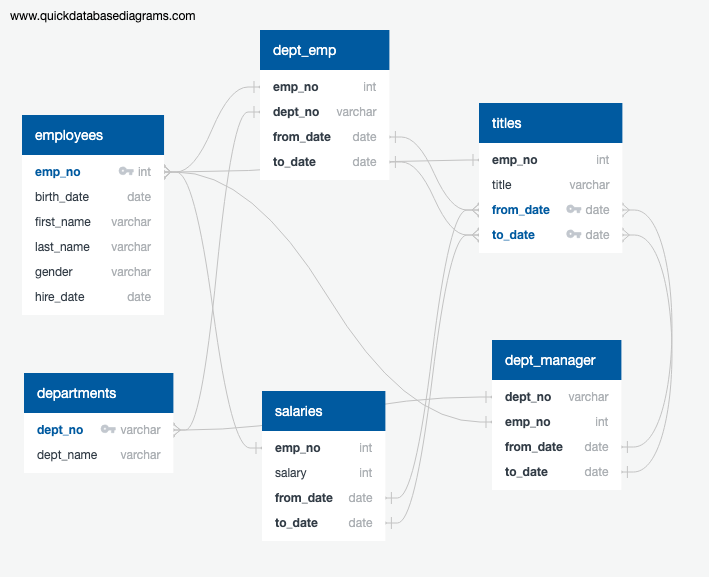

# SQL-Analysis on Pewlett Hackard Employee Database

In this project, I designed tables to hold data in 6 CSVs, imported the CSVs into a SQL database, and performed analysis using the data.

## Data Modeling

Inspected 6 CSVs and sketched out an ERD of the tables. 

## Data Engineering

I used the information to create a table schema for each of the 6 CSV files. (Data types, primary keys, foreign keys, and other constraints have been specified.)

Imported each CSV file into the corresponding SQL table.

## Data Analysis

With the information above, I wrote SQL queries and finished the following:

- List the following details of each employee: employee number, last name, first name, gender, and salary.
- List employees who were hired in 1986.
- List the manager of each department with the following information: department number, department name, the manager's employee number, last name, first name, and start and end employment dates.
- List the department of each employee with the following information: employee number, last name, first name, and department name.
- List all employees whose first name is "Hercules" and last names begin with "B."
- List all employees in the Sales department, including their employee number, last name, first name, and department name.
- List all employees in the Sales and Development departments, including their employee number, last name, first name, and department name.
- In descending order, list the frequency count of employee last names, i.e., how many employees share each last name.